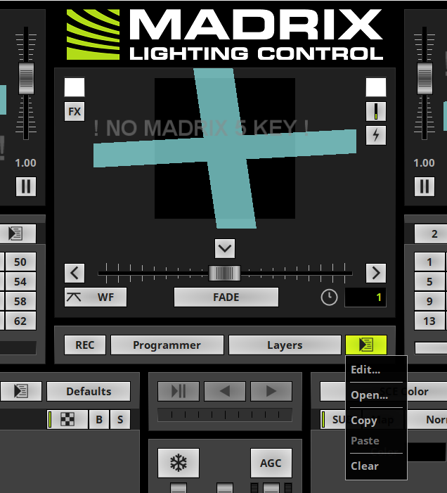

# Fader Centering Script

This script ensures that your fader remains **centered (position 0)** at all times. It also forces the fade type to be **"white fade"** for consistency.

## How to Use
1. Open the `.mms` file in your showfile to include it in your project.
2. To add the macro to your setup:
   - **Right-click** on the macro button.
3. If you encounter any issues, feel free to send me a message!

## Screenshot
Here's where you load the script, press right-click to open the menu. 
With the left-mouse button you can enable or disable the script. 

The button will then be blue, indicating a script is loaded but inactive.

